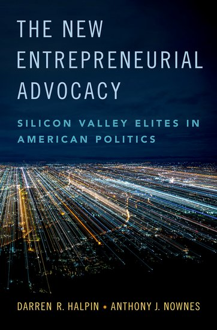

The New Entrepreneurial Advocacy: Silicon Valley Elites in American Politics, is out with Oxford University Press.  Authored by Lab Director Darren Halpin, with Anthony J. Nownes (University of Tennessee), the book provides a deep dive into the political engagement of this important slice of corporate America. The study covers over 150 Silicon Valley based firms and follows their CEOs and original Founders. It traces political donations at federal, state and local levels from both companies and CEOs; the private philanthropic donations of corporate elites; and the use of social media by Silicon Valley founders and CEOs to engage in US politics. Find details [here](https://global.oup.com/academic/product/the-new-entrepreneurial-advocacy-9780190883003?cc=au&lang=en&).
